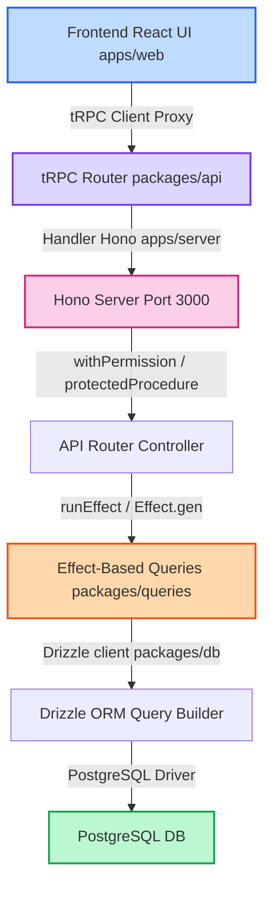

# Buku Panduan Pengembang & AI Agent (Playbook) — tepian-k3

Buku panduan ini dirancang untuk membantu pengembang manusia dan AI Agent mempercepat proses orientasi (onboarding), mendiagnosis dan memperbaiki bug, menambahkan fitur secara aman, serta memodifikasi tampilan antarmuka (UI) dengan mematuhi arsitektur monorepo Better-T-Stack yang dianut oleh proyek **tepian-k3**.

---

## 1. Peta Alur Data Monorepo (Codebase Map)

Aplikasi ini menggunakan TypeScript Monorepo dengan Turborepo + pnpm workspaces. Alur data dari interaksi pengguna di peramban (frontend) hingga penyimpanan data di basis data (PostgreSQL) digambarkan sebagai berikut:



### Modular Monolith Boundaries (Batas Modul)

Proyek ini menerapkan batasan domain yang ketat untuk mencegah *spaghetti code*:

```
[platform]
    ^ (hanya diperbolehkan import ke bawah dari domain bisnis)
    |
[pengujian] / [pelatihan] / [uji-kompetensi] / [konsultasi]
```

> [!CAUTION]
> **Dilarang keras melakukan peer import antar domain bisnis!**
> Contoh: Kode di dalam domain `pengujian` **tidak boleh** mengimpor berkas dari domain `pelatihan`, dan sebaliknya. Semua pertukaran data lintas domain wajib didelegasikan melalui modul `platform`.

---

## 2. Buku Panduan Debugging & Perbaikan Bug (Troubleshooting Playbook)

### A. Mengatasi Error Type Check (`pnpm check-types`)
Error tipe TypeScript biasanya terjadi ketika ada ketidaksesuaian antara skema basis data, skema Zod, dan model UI.

* **Langkah Penyelarasan**:
  1. Pastikan perubahan skema di `packages/db/src/schema/` sudah di-generate ke file TS/SQL menggunakan `pnpm db:generate`.
  2. Periksa skema Zod di `packages/schema/src/` apakah sudah diekstensi dari drizzle-zod menggunakan `createInsertSchema` atau `createSelectSchema`.
  3. Gunakan perintah `pnpm check-types` untuk melacak error secara detail.
* **Aturan AI Agent**: Batasi maksimal **2 kali** perbaikan tipe secara mandiri. Jika masih gagal, presentasikan pesan error dan alternatif struktur data kepada pengembang untuk didiskusikan.

### B. Error API & Jaringan tRPC

#### 1. Error 403 Forbidden (Akses Ditolak)
Error ini terjadi saat peran (role) atau izin (permission) pengguna saat ini tidak memenuhi syarat untuk mengeksekusi aksi/rute terkait.

* **JWT Stateless Caching**: Roles dan permissions pengguna di-cache secara stateless di dalam JWT access token saat proses autentikasi (login).
* **Solusi**: 
  > [!IMPORTANT]
  > Jika peran/izin baru saja diubah di basis data (PostgreSQL), pengguna **WAJIB melakukan logout dan login ulang** agar token JWT diperbarui dengan data izin terbaru dari basis data.
* **Pengecekan Kode**:
  1. Periksa middleware router di backend: pastikan endpoint dilindungi dengan `.use(withPermission("nama.permission"))`.
  2. Periksa rute guard frontend di `apps/web/src/routes/`: pastikan fungsi `beforeLoad` memanggil `requirePermission(context, { permission: "nama.permission" })`.

#### 2. Error 404 Halaman Tidak Ditemukan / Data Tidak Ditemukan
Error ini terjadi saat alamat rute tidak cocok atau data yang diminta telah dihapus.

* **Soft Delete Filter**: Semua tabel menggunakan spread `...timestamps` yang mencakup field `deletedAt` (untuk soft delete).
* **Solusi**:
  * Periksa query Drizzle di `packages/queries/src/`. Pastikan klausa `where` menyertakan pengecekan:
    ```typescript
    and(eq(table.id, id), isNull(table.deletedAt))
    ```
  * Jika bernilai non-null, data dianggap terhapus dan endpoint query akan mengembalikan `NOT_FOUND`.

#### 3. Error 500 Internal Server Error
Terjadi ketika ada unhandled exception di sisi backend (Hono).

* **Solusi**:
  * Periksa console output dev-server di port `:3000` (atau gunakan log manager) untuk melihat stack trace asli.
  * Masalah umum: Field JSONB dibaca sebagai string kosong atau struktur schema Zod input tidak cocok dengan parameter query Drizzle.

### C. Masalah Skema & Migrasi Database
Saat memodifikasi struktur database, pastikan urutan migrasi tidak merusak data dev.

* **Dev Push**: Gunakan `pnpm db:push` untuk menyinkronkan skema database lokal secara cepat tanpa membuat file migrasi baru (hanya di lingkungan development).
* **Production Build**: Gunakan `pnpm db:generate` diikuti dengan `pnpm db:migrate` untuk mencatat migrasi di production.
* **Conflict Recovery**: Jika file migrasi bentrok di repositori git, jalankan `pnpm db:reset` untuk mereset database lokal dan menerapkan ulang seluruh file migrasi dari awal.

---

## 3. Panduan Penambahan Fitur Baru (Step-by-Step Checklist)

Ketika menambahkan fitur baru, ikuti urutan integrasi Better-T-Stack ini dari bawah ke atas:

```
[1] Database Schema -> [2] Generate Migration -> [3] DB Queries (Effect) ->
[4] Zod Validation Schemas -> [5] tRPC Routers -> [6] Register Router ->
[7] TanStack Routes (Frontend) -> [8] Page Component UI & Action Hooks
```

| Langkah | Aksi | File Tujuan / Contoh |
| :--- | :--- | :--- |
| **1. DB Schema** | Tentukan struktur tabel dengan primary key UUIDv7 dan timestamps. | `packages/db/src/schema/<domain>.ts` |
| **2. Migration** | Generate file SQL migrasi dan terapkan ke DB lokal. | Jalankan `pnpm db:generate && pnpm db:migrate` |
| **3. DB Queries**| Tulis query database dibungkus dengan `Effect.tryPromise`. | `packages/queries/src/<domain>/<resource>.queries.ts` |
| **4. Zod Schema**| Definisikan schema validasi input form dan API payload. | `packages/schema/src/<domain>/<resource>.schema.ts` |
| **5. tRPC Router**| Buat tRPC prosedur baru dengan proteksi role/izin yang sesuai. | `packages/api/src/routers/<domain>/<resource>.ts` |
| **6. Register** | Daftarkan sub-router baru ke router utama domain. | `packages/api/src/routers/<domain>/index.ts` |
| **7. Route Web** | Tambahkan file routing frontend menggunakan TanStack Router. | `apps/web/src/routes/(core)/back-office/<path>/` |
| **8. Component** | Buat UI halaman yang memanggil queries/mutations tRPC. | Menggunakan `<form>`, `useQuery`, `useMutation` tRPC proxy |

---

## 4. Panduan Pembaruan UI & Modifikasi Tampilan

### A. CSS & Design Tokens (Variabel Warna)
Aplikasi ini menggunakan **Vanilla CSS** dengan **TailwindCSS 4**. Variabel warna diatur secara terpusat di `apps/web/src/index.css`.

* **Penggunaan**: Jangan menuliskan warna heksadesimal (`#ff0000`) atau warna tailwind kasar (`bg-red-500`) secara langsung di komponen. Selalu gunakan variabel token bertema:
  ```tsx
  // ✅ BENAR
  <div className="bg-primary text-primary-foreground border-border shadow-sm">
  
  // ❌ SALAH
  <div className="bg-[#1061D6] text-white border-slate-200">
  ```

### B. Komponen UI Standar (shadcn/ui)
Semua elemen visual umum wajib memanfaatkan komponen dari `@/components/ui/` demi konsistensi.

* **Tombol**: Gunakan `<Button variant="outline" size="sm">`
* **Input**: Gunakan `<Input>` dan `<Textarea>` yang terikat ke `react-hook-form` via `<FormControl>`
* **Dialog**: Gunakan `<Dialog>`, `<DialogContent>`, `<DialogHeader>`, `<DialogTitle>`
* **Card**: Gunakan `<Card>`, `<CardHeader>`, `<CardTitle>`, `<CardContent>`

### C. Tata Letak Responsif & Mobile-First
* Selalu mulai styling dari mobile viewport (lebar terkecil) tanpa prefix media query.
* Gunakan modifier `md:` (untuk tablet/desktop kecil) dan `lg:` (untuk desktop besar) untuk memodifikasi layout:
  ```tsx
  // Grid responsif: 1 kolom di mobile, 2 di tablet, 3 di desktop
  <div className="grid grid-cols-1 gap-4 md:grid-cols-2 lg:grid-cols-3">
  ```

### D. Optimalisasi & Performa Tampilan
1. **Pencarian / Search Input**: Wajib menggunakan debounce minimum `300ms` sebelum memicu fetch API tRPC baru guna menghindari rate limiting.
2. **Gambar (Broken Asset Protection)**: Wajib menggunakan komponen `<ImageWithFallback>` untuk mencegah tampilan gambar rusak jika URL thumbnail bermasalah.
3. **Loading State**: Gunakan skeleton loader (`SkeletonInput`, `SkeletonButton`) daripada spinner kosong untuk memberikan impresi loading yang premium dan minim layout shift.

---

## 5. Panduan Taktis AI Agent (LLM-Friendly Pointers)

Untuk agen AI yang membantu pengerjaan proyek ini:

1. **Pencarian Kode Efisien**:
   * Prioritaskan `grep_search` dengan filter jenis file yang spesifik (misalnya `Includes: ["*.ts", "*.tsx"]`) untuk mempersempit ruang pencarian.
   * Hindari membaca file yang sangat besar dari awal jika hanya ingin menganalisis fungsi tertentu. Gunakan baris awal/akhir (`StartLine` / `EndLine`) di `view_file` jika lokasi barisnya sudah diketahui.

2. **Gaya Penulisan Kode**:
   * **JSDoc Wajib**: Semua fungsi, hooks, dan komponen yang diekspor wajib memiliki JSDoc berbahasa Indonesia lengkap dengan deskripsi parameter dan nilai kembalian.
   * **Authorship Header**: Setiap kali membuat file baru atau memodifikasi block kode yang cukup besar, wajib menyertakan penanda identitas generator:
     ```typescript
     // ##################
     // authored (generated by <agent_name>, <timestamp> WITA)
     // ##################
     ```

3. **Prinsip "Zero Unsaved Code"**:
   * Selalu jalankan `pnpm check-types` dan `pnpm web:prettier` sesaat setelah memodifikasi kode. Pastikan kedua perintah tersebut sukses sebelum menyerahkan rincian instruksi Git kepada pengguna.
