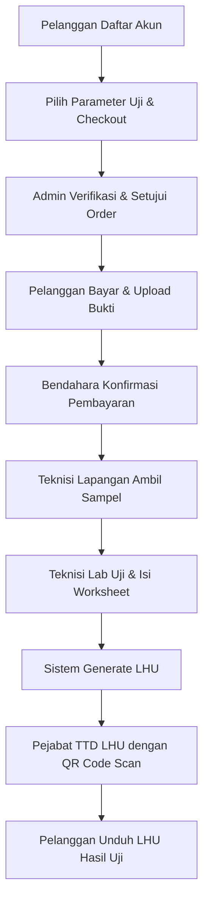

# Panduan Pengguna & Alur Bisnis Tepian K3

## (Tepian K3 User & Business Flow Handbook)

Selamat datang di **Panduan Pengguna Tepian K3**. Buku panduan ini disusun khusus menggunakan bahasa yang sederhana dan bebas dari istilah teknis pemrograman agar mudah dipahami oleh **orang awam**.

Panduan ini ditujukan untuk seluruh pengguna aplikasi: **Pelanggan/Peserta**, **Admin Back-Office**, **Bendahara Keuangan**, **Teknisi Laboratorium**, dan **Instruktur Pelatihan**.

---

## 📌 DAFTAR ISI

1. [Pengenalan Peran Pengguna (Siapa Anda?)](#1-pengenalan-peran-pengguna-siapa-anda)
2. [Panduan Modul Layanan Pengujian Laboratorium K3](#2-panduan-modul-layanan-pengujian-laboratorium-k3)
   - [Langkah 1: Registrasi Akun & Profil Perusahaan](#langkah-1-registrasi-akun--profil-perusahaan)
   - [Langkah 2: Memilih Parameter & Membuat Pesanan (Order)](#langkah-2-memilih-parameter--membuat-pesanan-order)
   - [Langkah 3: Persetujuan Pesanan oleh Admin](#langkah-3-persetujuan-pesanan-oleh-admin)
   - [Langkah 4: Melakukan & Memverifikasi Pembayaran](#langkah-4-melakukan--memverifikasi-pembayaran)
   - [Langkah 5: Pengambilan Sampel & Pengujian Lab](#langkah-5-pengambilan-sampel--pengujian-lab)
   - [Langkah 6: Pengisian Lembar Kerja (Worksheet) oleh Teknisi](#langkah-6-pengisian-lembar-kerja-worksheet-oleh-teknisi)
   - [Langkah 7: Penerbitan & Tanda Tangan Laporan (LHU) via QR Code](#langkah-7-penerbitan--tanda-tangan-laporan-lhu-via-qr-code)
3. [Panduan Modul Pelatihan K3 (Learning Management System)](#3-panduan-modul-pelatihan-k3-learning-management-system)
   - [Langkah 1: Mendaftar Kelas Pelatihan (Gratis & Berbayar)](#langkah-1-mendaftar-kelas-pelatihan-gratis--berbayar)
   - [Langkah 2: Mengikuti Pembelajaran di Ruang Kelas Digital](#langkah-2-mengikuti-pembelajaran-di-ruang-kelas-digital)
   - [Langkah 3: Memahami Sistem Kunci Materi Berurutan](#langkah-3-memahami-sistem-kunci-materi-berurutan)
   - [Langkah 4: Melakukan Presensi Kehadiran Kelas (Live Class)](#langkah-4-melakukan-presensi-kehadiran-kelas-live-class)
   - [Langkah 5: Mengerjakan Ujian & Evaluasi Ujian](#langkah-5-mengerjakan-ujian--evaluasi-ujian)
   - [Langkah 6: Penilaian Ujian Esai oleh Instruktur](#langkah-6-penilaian-ujian-esai-oleh-instruktur)
   - [Langkah 7: Kelulusan & Mengunduh Sertifikat Digital](#langkah-7-kelulusan--mengunduh-sertifikat-digital)
4. [Tanya Jawab & Troubleshooting Umum](#4-tanya-jawab--troubleshooting-umum)

---

## 1. PENGENALAN PERAN PENGGUNA (SIAPA ANDA?)

Setiap pengguna yang masuk ke aplikasi Tepian K3 memiliki "peran" (role) masing-masing yang menentukan tombol dan menu apa saja yang bisa mereka lihat:

- **Pelanggan / Peserta**: Pihak eksternal (perwakilan perusahaan atau individu). Tugasnya memesan uji laboratorium, membayar pesanan, mengikuti materi pelatihan, ujian, dan mengunduh laporan hasil uji atau sertifikat.
- **Admin Back-Office**: Staf internal laboratorium. Tugasnya memverifikasi pendaftaran perusahaan, menyetujui pesanan pengujian, menerbitkan Surat Perintah Tugas (SPT) lapangan, serta mengelola data dasar pelatihan.
- **Bendahara Keuangan**: Staf internal keuangan. Tugasnya memverifikasi bukti transfer pembayaran yang diunggah oleh pelanggan untuk pengujian maupun pelatihan berbayar.
- **Teknisi Laboratorium (Employee)**: Staf teknis lab. Tugasnya melakukan uji sampel fisik/kimia/biologi dan mengisi lembar kerja teknis (_Worksheet_) yang mencakup bahan, alat, dan biaya operasional.
- **Instruktur Pelatihan**: Pengajar/narasumber kelas K3. Tugasnya membagikan token kehadiran siswa, memantau kemajuan belajar, serta menilai jawaban ujian esai peserta secara manual.
- **Super Admin**: Kepala Balai atau Manajer IT yang memiliki wewenang penuh atas seluruh fungsi sistem, pembagian tugas staf, dan melihat log aktivitas audit.

---

## 2. PANDUAN MODUL LAYANAN PENGUJIAN LABORATORIUM K3

Layanan pengujian digunakan oleh industri untuk mengukur faktor bahaya lingkungan kerja (misal: tingkat kebisingan, kualitas udara, pencahayaan, atau limbah).

### Langkah 1: Registrasi Akun & Profil Perusahaan

- **Siapa yang melakukan**: Pelanggan (Perusahaan).
- **Cara Menggunakan**:
  1. Akses halaman registrasi di web Tepian K3.
  2. Isi formulir pendaftaran akun (Email, Nama Lengkap, Nomor HP, Password).
  3. Setelah login pertama kali, masuk ke menu **Profil Perusahaan**.
  4. Isi data detail perusahaan Anda seperti Nama Perusahaan, Bidang Usaha (KBLI), Alamat Kantor, Alamat Lokasi Pengujian, dan Nomor Pokok Wajib Pajak (NPWP).
  5. Klik **Simpan**. Akun Anda kini siap melakukan pemesanan.

### Langkah 2: Memilih Parameter & Membuat Pesanan (Order)

- **Siapa yang melakukan**: Pelanggan (Perusahaan).
- **Cara Menggunakan**:
  1. Masuk ke menu **Katalog Pengujian**.
  2. Gunakan kolom pencarian untuk menemukan parameter pengujian yang Anda butuhkan (contoh: _Kebisingan 24 Jam_, _Kadar Debu Area Kerja_, atau _Gas Emisi_).
  3. Klik tombol **Tambah ke Keranjang** untuk setiap parameter yang ingin diuji.
  4. Masuk ke halaman **Keranjang**, pilih lokasi pengujian Anda yang telah didaftarkan sebelumnya.
  5. Periksa ringkasan parameter yang dipilih, kemudian klik **Checkout/Buat Pesanan**. Pesanan Anda akan berstatus `Menunggu Persetujuan` (_Pending Approval_).

### Langkah 3: Persetujuan Pesanan oleh Admin

- **Siapa yang melakukan**: Admin Back-Office.
- **Cara Menggunakan**:
  1. Masuk ke portal **Back-Office**, lalu buka menu **Daftar Order/Pesanan**.
  2. Pilih pesanan terbaru milik pelanggan yang berstatus `Menunggu Persetujuan`.
  3. Periksa ketersediaan alat dan tim penguji untuk lokasi dan parameter yang diminta.
  4. Jika semua sesuai, klik **Setujui Pesanan** (_Approve_).
  5. Admin kemudian menunjuk tim petugas sampling lapangan dan menerbitkan berkas digital **Surat Perintah Tugas (SPT)** dan **Surat Perintah Kerja (SPK)** di sistem.

### Langkah 4: Melakukan & Memverifikasi Pembayaran

- **Siapa yang melakukan**: Pelanggan (Perusahaan) & Bendahara Keuangan.
- **Cara Menggunakan**:
  1. **Pelanggan**: Masuk ke menu **Transaksi Saya**, temukan pesanan yang baru disetujui. Statusnya kini berubah menjadi `Menunggu Pembayaran`.
  2. Anda akan melihat nominal tagihan (Invoice). Lakukan transfer bank ke rekening balai yang tertera.
  3. Foto/screenshot bukti transfer, klik tombol **Upload Bukti Pembayaran**, unggah gambar tersebut, lalu klik **Kirim**. Status pesanan berubah menjadi `Sedang Diverifikasi`.
  4. **Bendahara**: Masuk ke panel Back-Office keuangan. Buka menu **Verifikasi Pembayaran**.
  5. Periksa gambar bukti transfer yang diunggah pelanggan dengan mutasi rekening bank balai.
  6. Jika dana sudah masuk, klik **Konfirmasi Pembayaran**. Sistem otomatis mengubah status order menjadi `Pembayaran Terverifikasi` dan memicu dimulainya proses pengujian.

### Langkah 5: Pengambilan Sampel & Pengujian Lab

- **Siapa yang melakukan**: Petugas Lapangan & Teknisi Laboratorium.
- **Cara Menggunakan**:
  1. Petugas Lapangan berangkat ke lokasi klien berbekal SPT dan SPK yang diunduh dari aplikasi.
  2. Setelah mengambil sampel di lapangan, petugas kembali ke balai dan menyerahkan sampel fisik ke unit laboratorium bersama berkas penyerahan sampel.
  3. Teknisi Lab menerima sampel tersebut dan melakukan pengujian menggunakan peralatan laboratorium sesuai parameter masing-masing.

### Langkah 6: Pengisian Lembar Kerja (Worksheet) oleh Teknisi

- **Siapa yang melakukan**: Teknisi Laboratorium.
- **Cara Menggunakan**:
  1. Teknisi Lab masuk ke sistem dan membuka menu **Daftar Pengujian / Lembar Kerja (Worksheet)**.
  2. Cari nomor order atau sampel yang sedang diuji.
  3. Klik **Isi Worksheet**. Di sini teknisi harus memasukkan data teknis:
     - **Hasil Uji**: Angka atau parameter nilai hasil pengujian laboratorium.
     - **Alat Lab**: Pilih alat laboratorium apa saja yang digunakan (sistem otomatis mencatat kalibrasi alat).
     - **Bahan Kimia**: Input nama dan volume bahan kimia/reagen yang dihabiskan untuk pengujian ini.
     - **Biaya Operasional**: Masukkan biaya tambahan seperti biaya bensin kendaraan, konsumsi petugas, atau akomodasi lapangan (jika ada).
  4. Setelah data diisi lengkap dan akurat, klik **Simpan & Selesaikan Lembar Kerja**.

### Langkah 7: Penerbitan & Tanda Tangan Laporan (LHU) via QR Code

- **Siapa yang melakukan**: Kepala Balai / Pejabat Berwenang & Pelanggan.
- **Cara Menggunakan**:
  1. Setelah semua worksheet terisi, sistem Tepian K3 otomatis mengombinasikan data hasil uji dan biaya operasional untuk menghasilkan berkas draf **Laporan Hasil Uji (LHU)** resmi.
  2. Kepala Balai/Pejabat masuk ke menu **Persetujuan Laporan (Approval LHU)**.
  3. Klik untuk memverifikasi isi LHU.
  4. Untuk menandatangani LHU secara digital, pejabat cukup menekan tombol **Tanda Tangani Laporan**. Sistem akan men-generate gambar sertifikat LHU yang dilengkapi **QR Code unik**.
  5. **Pelanggan**: Masuk ke menu **Daftar Laporan Hasil Uji**, cari pesanan Anda yang sudah berstatus `Selesai`. Anda sekarang bisa mengunduh dokumen LHU PDF resmi yang valid dan sah dengan tanda tangan QR Code tersebut.

---

## 3. PANDUAN MODUL PELATIHAN K3 (LEARNING MANAGEMENT SYSTEM)

Modul Pelatihan digunakan untuk pendaftaran, proses belajar online, presensi kehadiran, hingga ujian sertifikasi keahlian K3.

### Langkah 1: Mendaftar Kelas Pelatihan (Gratis & Berbayar)

- **Siapa yang melakukan**: Peserta Pelatihan.
- **Cara Menggunakan**:
  1. Buka menu **Katalog Pelatihan** di halaman utama web.
  2. Pilih pelatihan K3 yang ingin diikuti (misal: _Sertifikasi Ahli K3 Umum_, _Pelatihan Fire Safety_, atau _Pertolongan Pertama P3K_).
  3. Klik tombol **Detail Pelatihan** untuk membaca deskripsi kelas, silabus, dan jadwal.
  4. **Pendaftaran**:
     - **Kelas Gratis**: Klik tombol **Daftar Sekarang**. Kelas akan langsung aktif di dashboard belajar Anda.
     - **Kelas Berbayar**: Klik tombol **Tambah ke Keranjang**, lalu selesaikan transaksi di menu Keranjang. Anda perlu melakukan transfer pembayaran dan menunggu Bendahara Keuangan memverifikasi bukti bayar Anda (proses verifikasi sama seperti pada Modul Pengujian).

### Langkah 2: Mengikuti Pembelajaran di Ruang Kelas Digital

- **Siapa yang melakukan**: Peserta Pelatihan.
- **Cara Menggunakan**:
  1. Masuk ke menu **Dashboard Belajar** atau **Kelas Saya**.
  2. Pilih kelas aktif yang ingin Anda pelajari, lalu klik **Mulai Belajar**.
  3. Anda akan masuk ke halaman Ruang Kelas Digital. Di bagian samping kiri terdapat **Daftar Kurikulum** (Bab/Materi), dan di sebelah kanan terdapat area konten utama (video player, pembaca dokumen PDF, atau teks artikel).
  4. Pelajari materi (tonton video hingga selesai atau baca dokumen PDF) yang disediakan.

### Langkah 3: Memahami Sistem Kunci Materi Berurutan

- **Siapa yang melakukan**: Peserta Pelatihan.
- **Aturan Kritis**:
  > [!IMPORTANT]
  > **Sequential Lock**: Sistem Tepian K3 tidak mengizinkan Anda melompati materi. Anda harus mempelajari dan menekan tombol **Selesai & Lanjutkan** pada materi Bab 1 sebelum sistem mengizinkan Anda membuka Bab 2.
  - Jika Anda mencoba memaksa mengklik materi yang terkunci di daftar kurikulum sebelah kiri, sistem akan menampilkan pesan peringatan bahwa materi sebelumnya belum diselesaikan.

### Langkah 4: Melakukan Presensi Kehadiran Kelas (Live Class)

- **Siapa yang melakukan**: Instruktur & Peserta Pelatihan.
- **Cara Menggunakan**:
  1. **Instruktur**: Saat sesi kelas tatap muka langsung (baik di kelas fisik maupun panggilan video live), buka menu kelola kelas Anda lalu klik **Buat Presensi Hari Ini**. Sistem akan menampilkan **Token Kehadiran** berupa 10 karakter acak (contoh: `K3LIVE1024`). Bagikan token ini kepada para peserta.
  2. **Peserta**: Di ruang kelas digital Anda, buka bab/materi yang berjudul **Presensi / Kehadiran Sesi Live**.
  3. Masukkan 10 karakter token tersebut ke dalam kolom input presensi yang tersedia, kemudian klik **Kirim Kehadiran**.
  4. Jika token cocok, status kehadiran Anda otomatis tercatat sebagai `Hadir` (_Present_) dan materi tersebut akan ditandai selesai.

### Langkah 5: Mengerjakan Ujian & Evaluasi Ujian

- **Siapa yang melakukan**: Peserta Pelatihan.
- **Cara Menggunakan**:
  1. Di bagian akhir kurikulum atau bab tertentu, Anda akan menemukan materi bertipe **Ujian (Assessment)** seperti Pre-test atau Post-test.
  2. Klik materi tersebut, baca petunjuk ujian (jumlah soal, batas waktu, dan nilai kelulusan minimal), lalu klik **Mulai Ujian**.
  3. Jawab seluruh pertanyaan yang muncul di layar:
     - **Soal Pilihan Ganda**: Klik pada salah satu opsi jawaban yang Anda anggap paling benar.
     - **Soal Esai**: Ketik jawaban penjelasan Anda secara lengkap pada kotak teks yang disediakan.
  4. Jika semua soal sudah dijawab, klik **Kirim Ujian** (_Submit_).

### Langkah 6: Penilaian Ujian Esai oleh Instruktur

- **Siapa yang melakukan**: Instruktur Pelatihan.
- **Cara Menggunakan**:
  1. Untuk soal pilihan ganda, nilai peserta akan langsung keluar secara otomatis di layar. Namun, untuk soal bertipe **Esai**, instruktur harus menilainya terlebih dahulu.
  2. Instruktur masuk ke halaman kelola kelas, pilih menu **Penilaian Esai**.
  3. Pilih nama peserta dan jenis ujian yang baru saja dikirimkan.
  4. Baca jawaban esai peserta, masukkan nilai poin yang diperoleh untuk setiap soal, serta berikan komentar/catatan umpan balik (feedback) jika diperlukan.
  5. Setelah selesai memberikan nilai untuk seluruh pertanyaan esai peserta tersebut, klik **Simpan & Kirim Nilai**. Nilai total peserta akan dihitung ulang secara otomatis oleh sistem.

### Langkah 7: Kelulusan & Mengunduh Sertifikat Digital

- **Siapa yang melakukan**: Peserta Pelatihan.
- **Cara Menggunakan**:
  1. Setelah ujian Post-test selesai dinilai (secara otomatis atau setelah dinilai esainya oleh instruktur), sistem akan mencocokkan total nilai Anda dengan nilai kelulusan (_passing score_) kelas.
  2. Jika nilai Anda memenuhi syarat kelulusan, status pendaftaran kelas Anda akan berubah menjadi `Lulus` (_Completed_).
  3. Masuk ke halaman kelas Anda atau menu **Sertifikat Saya**.
  4. Klik tombol **Unduh Sertifikat**. Sertifikat digital berformat PDF akan diunduh ke perangkat Anda. Sertifikat ini sah dan memiliki **QR Code verifikasi** di bagian bawahnya yang dapat digunakan oleh perusahaan Anda untuk memverifikasi keaslian sertifikat tersebut.

---

## 4. TANYA JAWAB & TROUBLESHOOTING UMUM

### ❓ Mengapa menu sidebar baru (seperti "Import / Export Data Master") tidak muncul setelah akun saya naik tingkat/diubah perannya?

- **Jawaban**: Hak akses Anda disimpan sementara di browser Anda. Jika admin baru saja mengubah peran (_role_) atau izin akun Anda di database, perubahan ini tidak langsung terlihat di browser Anda.
- **Solusi**: Silakan klik tombol **Keluar (Logout)** di sudut kiri bawah sidebar, lalu lakukan **Masuk (Login)** ulang. Langkah ini akan menyinkronkan ulang seluruh menu sesuai hak akses baru Anda.

### ❓ Bagaimana cara memverifikasi keaslian dokumen Laporan Hasil Uji (LHU) atau Sertifikat K3 Tepian?

- **Jawaban**: Cukup scan QR Code yang tertera di bagian bawah sertifikat atau dokumen LHU fisik/PDF menggunakan kamera ponsel pintar Anda. Link scan tersebut akan mengarahkan Anda ke halaman verifikasi resmi aplikasi Tepian K3 (`tepiank3.tech/verify/...`) yang menampilkan informasi keabsahan dokumen, nama pemilik/perusahaan, dan tanggal terbit.

### ❓ Mengapa tombol "Mulai Belajar" di halaman Pelatihan terkunci atau berwarna abu-abu?

- **Jawaban**:
  1. Pastikan Anda sudah masuk ke akun Anda.
  2. Jika pelatihan tersebut berbayar, pastikan Anda telah menyelesaikan pembayaran dan bukti pembayaran Anda telah disetujui oleh Bendahara Keuangan (Status pesanan di halaman transaksi harus bernilai `Selesai` atau `Pembayaran Diterima`).

### ❓ Apa yang harus saya lakukan jika waktu pengerjaan ujian habis saat saya sedang mengetik jawaban esai?

- **Jawaban**: Sistem secara otomatis akan menyimpan jawaban terakhir yang Anda ketik dan melakukan _auto-submit_ saat durasi waktu ujian habis. Anda tidak perlu khawatir kehilangan seluruh jawaban Anda. Namun, disarankan untuk mengisi jawaban secara efisien dan memperhatikan durasi sisa waktu di bagian atas layar.

---

_Dokumen ini merupakan panduan operasional resmi untuk seluruh pengguna Tepian K3. Diperbarui terakhir: 26 Juni 2026._
