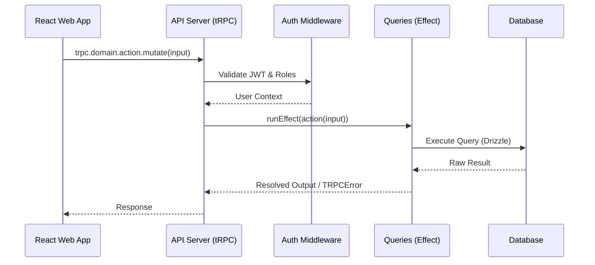

# Arsitektur Proyek & Monorepo

Sistem **tepian-k3** adalah sistem manajemen laboratorium pengujian K3 yang dibangun menggunakan pendekatan **TypeScript Monorepo** (dengan Turborepo + pnpm workspaces).

## 1. Struktur Folder Monorepo

Proyek ini terbagi menjadi dua bagian utama: aplikasi (`apps/`) dan pustaka bersama (`packages/`).

```
tepian-k3/
├── apps/
│   ├── web/                    # React frontend (TanStack Router, port 3001)
│   │   ├── src/routes/         # File-based routing (core & public)
│   │   └── docs/               # Web-specific documentation
│   └── server/                 # Hono backend with tRPC handler (port 3000)
│       └── src/middlewares/    # Auth, CORS, logging
│
├── packages/
│   ├── api/                    # tRPC routers (platform, pengujian, pelatihan)
│   ├── auth/                   # JWT middleware + permission helpers
│   ├── db/                     # Drizzle schema + migrations
│   ├── queries/                # Effect-based DB query functions
│   ├── schema/                 # Zod validation schemas
│   ├── services/               # Layanan eksternal (email, storage, logger, pdf)
│   ├── types/                  # Shared TypeScript types
│   ├── utils/                  # Shared utility functions
│   ├── constants/              # App-wide constants & permissions
│   ├── config/                 # Konfigurasi shared (tsconfig.base.json)
│   └── shared/                 # Utilitas cross-app
│
├── turbo.json                  # Turborepo pipeline configuration
└── pnpm-workspace.yaml         # Definisi pnpm workspace
```

### Urutan Build Dependensi
Karena ini adalah monorepo, Turborepo membangun paket sesuai grafik dependensi berikut:
`constants → types → schema → db → queries → services → auth → api → apps`

Gunakan namespace `@tepian-k3/<package>` (contoh: `@tepian-k3/db/client`) saat mengimpor antar modul.

### Daftar Paket (Packages)

| Paket | Tanggung Jawab | Aturan & Ketentuan |
|---|---|---|
| `@tepian-k3/api` | tRPC Router | Tidak boleh berisi *raw query*. Menggabungkan layanan. |
| `@tepian-k3/auth` | JWT & Role Guard | Terisolasi, mengelola validasi token. |
| `@tepian-k3/db` | Client Drizzle ORM | Penyedia instansiasi Drizzle PostgreSQL. |
| `@tepian-k3/queries`| Fungsional (Effect) DB | *Single-source of truth* untuk interaksi DB (wajib dites). |
| `@tepian-k3/schema` | Drizzle & Zod Schema | Seluruh tabel, UUIDv7, Soft delete, dan tipe validasi. |
| `@tepian-k3/services`| Layanan Eksternal | Upload/download, notifikasi, pihak ketiga. |

## 2. Arsitektur Data Flow (tRPC & Effect)

Setiap request dari klien diproses mengikuti urutan yang kaku demi menjaga *Type Safety* penuh (E2E) dan prediktabilitas.



Untuk menghindari arsitektur kode spaghetti, sistem memberlakukan batasan arah impor data (Modular Monolith):

```
platform        ← Tidak boleh impor dari domain manapun
    ^
pengujian       ← Hanya boleh impor dari platform
pelatihan       ← Hanya boleh impor dari platform
uji-kompetensi  ← Hanya boleh impor dari platform
konsultasi      ← Hanya boleh impor dari platform
```

> **Aturan Penting**: Domain modul (seperti pengujian dan pelatihan) **TIDAK BOLEH** saling impor satu sama lain. Pertukaran data lintas domain harus selalu dijembatani oleh modul `platform`.

## 3. Optimalisasi Turborepo

Monorepo ini memanfaatkan **Turborepo** untuk memaksimalkan efisiensi pengembangan (Developer eXperience).

- **Eksekusi Paralel**: Menjalankan task seperti `build` dan `lint` secara paralel lintas paket.
- **Caching Pintar**: Menghindari build ulang kode yang tidak berubah.
- **Build Inkremental**: Hanya membangun komponen spesifik yang dimodifikasi.

Konfigurasi `turbo.json` secara otomatis mengatur urutan tugas:
```json
{
  "tasks": {
    "build": {
      "dependsOn": ["^build"],
      "outputs": ["dist/**"]
    },
    "dev": {
      "dependsOn": ["^build"],
      "cache": false,
      "persistent": true
    }
  }
}
```

Jika terjadi masalah cache saat proses build, Anda dapat membersihkan cache secara paksa menggunakan:
```bash
# Hapus direktori cache lokal
rm -rf .turbo

# Build paksa melewati cache
pnpm turbo run build --force
```
