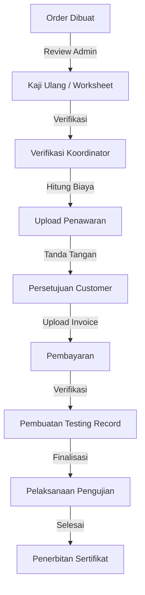
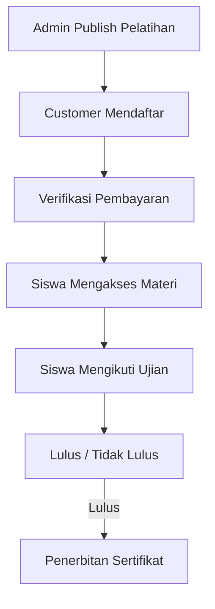

# Alur Bisnis (Business Flow)

Dokumen ini menjelaskan alur bisnis lengkap untuk layanan pengujian di **tepian-k3**, dari pembuatan order hingga penerbitan sertifikat.

## Ringkasan Alur Transaksi

## Detail Alur Transaksi Lengkap

### Fase 1: Pembuatan Order & Review
1. **Customer membuat order**
   - User memilih parameter dan membuat order dari keranjang (cart).
   - Status order: `pending`.
2. **Admin mereview order yang masuk**
   - Melihat daftar order yang `pending`.
   - Memeriksa detail order, parameter, jumlah.
   - Mempersiapkan untuk review teknis (kaji ulang).

### Fase 2: Kaji Ulang Teknis (Pembuatan Worksheet)
3. **Admin membuat worksheet awal**
   - Melakukan review dan konfirmasi:
     - **Parameter** yang dibutuhkan untuk pengujian.
     - **Bahan** yang diperlukan.
     - **Alat/Peralatan** yang dibutuhkan (`worksheetTools`).
     - **Estimasi durasi** (kemungkinan hari yang akan dikerjakan).
     - **Jumlah tim** (total anggota yang dibutuhkan).
   - Status worksheet: `draft` atau `pending_verification`.
   - **CATATAN**: Worksheet ini belum terhubung ke testing karena testing record belum dibuat.
4. **Admin membuat worksheet items**
   - Untuk setiap parameter yang akan diuji, menentukan lokasi dan jumlah, lalu menghubungkan alat via `parameterTools`.

### Fase 3: Verifikasi Koordinator
5. **Koordinator mereview dan memverifikasi worksheet**
   - Mereview kelayakan teknis (spesifikasi, alat, bahan, jadwal, kapasitas tim).
   - Menunjuk supervisor (`mainSupervisorId`, `accompanyingSupervisorId`).
   - Menunjuk teknisi lab (`worksheetAssignments`).
   - Status worksheet: `pending_verification` → `verified`.

### Fase 4: Perhitungan Biaya & Penawaran
6. **Koordinator/Admin menghitung biaya transaksi**
   - Menghitung total biaya berdasarkan parameter, durasi, anggota tim, dan penggunaan alat.
   - Memperbarui harga order jika diperlukan.
   - Status order: `pending` → `approved`.
7. **Admin mengupload surat penawaran** (Offering Document)
   - Dokumen (`ORDER` > `OFFERING_LETTER`) mencakup parameter, jadwal, tim, dan rincian biaya.
   - Customer dinotifikasi.

### Fase 5: Persetujuan Customer
8. **Admin mengupload template surat persetujuan** (Cooperation Agreement Template).
9. **Customer download, tanda tangan, dan upload** (`signed_offering_approval`).
   - Timestamp `approvedAt` pada order diset.

### Fase 6: Invoice & Pembayaran
10. **Admin mengupload**:
    - `invoice` (Invoice dengan detail pembayaran).
    - `cooperation_agreement` (Surat Perjanjian Kerjasama).
11. **Customer mengupload**:
    - `signed_cooperation_agreement` (Surat perjanjian yang sudah ditandatangani).
    - `proof_of_payment` (Bukti pembayaran).
12. **Admin memverifikasi pembayaran**
    - Status order: `approved` → `unpaid` → `paid`.

### Fase 7: Pembuatan Testing Record (Setelah Pembayaran)
13. **Admin membuat record testing** (terhubung ke orderId)
    - Generate `testingNumber` yang unik.
    - Menghubungkan ke `orderId`, `userId`, `companyId`, `testingType`.
    - Status testing: `start_testing`.
14. **Sistem membuat testing items**
    - Satu `testingItem` per `orderItem`.
15. **Worksheet dihubungkan ke testing**
    - Update `worksheet.testingId` untuk menghubungkan worksheet yang sudah ada ke testing yang baru.

### Fase 8: Persiapan Pelaksanaan & Pengujian
16. **Admin finalisasi worksheet**
    - Konfirmasi jadwal final dan tim yang ditunjuk.
    - Status worksheet: `verified` → `ready` atau `in_progress`.
17. **Admin menerbitkan dokumen**:
    - `worksheet_document`, `spt_document`, `testing_schedule`.
    - Status testing: `start_testing` → `in_progress`.
18. **Teknisi lab melakukan pengujian**
    - Teknisi mengakses worksheet, melihat `worksheetItems` dan `worksheetTools`.
    - Mencatat `value` (hasil pengujian mentah) di `worksheetItem`.
    - Menandai `isReady` sebagai true saat selesai.
19. **Update hasil testing item**
    - Menyalin hasil dari `worksheetItems` ke `testingItem.result` (hasil final terformat untuk sertifikat).
20. **Menyelesaikan worksheet & testing**
    - Set `worksheet.endDate` dan `worksheet.result`.
    - Status worksheet: `in_progress` → `completed`.
    - Status testing: `in_progress` → `completed`.

### Fase 9: Sertifikat & Pengiriman
21. **Admin generate sertifikat**
    - Generate PDF sertifikat dengan verifikasi QR (`TESTING` > `CERTIFICATE`).
22. **User berwenang menandatangani sertifikat** (digital signature).
23. **Pengiriman**
    - Customer menerima sertifikat.
    - Status order: `paid` → `completed` → `delivered`.

---

## Key Points & Aturan Skema (Schema Rules) Pengujian

- **Worksheet dibuat PERTAMA** (di fase kaji ulang, sebelum penawaran dikirim ke customer).
- **Testing record dibuat TERAKHIR** (hanya setelah pembayaran dikonfirmasi).
- **Relasi**:
  - `worksheet.testingId` = `NULL` saat awal dibuat. Diisi/di-update setelah testing record dibuat.
- **Transisi Status Worksheet**: `draft` → `pending_verification` → `verified` → `ready` → `in_progress` → `completed`

---

## Alur Transaksi Pelatihan (LMS)

### Fase 1: Persiapan Kelas
1. **Admin membuat Master Pelatihan** (E-learning, Bimtek, Webinar).
2. **Admin menyusun Silabus & Materi** (Video, Modul PDF, dll).
3. **Admin menyusun Soal Ujian/Assessment**.
4. **Admin mengubah status pelatihan menjadi `published`**.

### Fase 2: Pendaftaran & Pembayaran
1. **Customer memilih pelatihan dan checkout (Order)**.
2. **Customer melakukan pembayaran**.
3. **Admin memverifikasi pembayaran**, dan status order berubah menjadi `paid`.
4. Sistem otomatis membuat `enrollment` untuk setiap peserta yang didaftarkan.

### Fase 3: Pelaksanaan & Pembelajaran
1. **Peserta (Siswa) login dan membuka menu Profil Belajar**.
2. **Peserta mengakses materi** secara berurutan sesuai silabus.
3. **Peserta mengikuti ujian** (Assessment) di akhir sesi.

### Fase 4: Kelulusan & Sertifikat
1. **Sistem menghitung nilai ujian otomatis**.
2. Jika lulus (nilai > passing grade), **sistem meng-generate Sertifikat**.
3. Peserta dapat mendownload sertifikat digital dari menu profil mereka.
