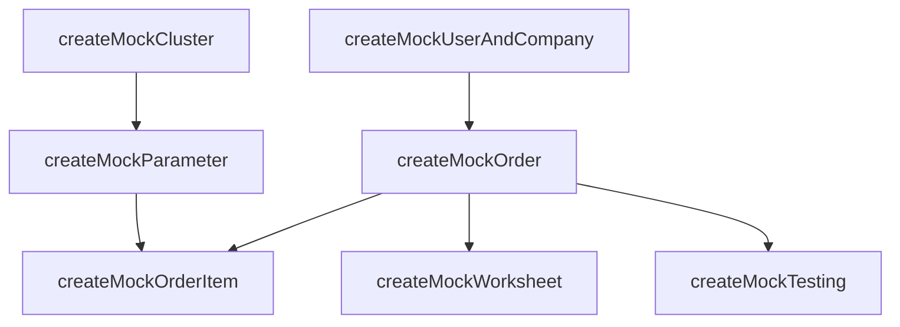

# Referensi Fixtures untuk Pengujian

File: `packages/queries/src/__tests__/helpers/fixtures.ts`

Fixtures adalah fungsi helper (*factory functions*) yang bertugas membuat data tiruan (mock data) ke database *in-memory* PGlite dengan memenuhi semua *constraints* (tipe, NOT NULL, dan relasi/foreign keys).

Jika Anda membutuhkan entitas anak, fixture akan memanggil fixture untuk entitas induk secara otomatis jika belum tersedia. Hal ini sangat menyederhanakan kode pengujian.

## Daftar Fixture Utama

Berikut adalah fixture yang bisa Anda gunakan dalam pengujian, urut dari tingkat *parent* hingga *child*.

| Fungsi Fixture | Entitas yang Dibuat | Relasi (Otomatis dibuat jika tidak disertakan) | Catatan |
|---|---|---|---|
| `createMockUserAndCompany(db)` | `users`, `companies`, relasi user-company | - | Berguna sebagai dasar untuk semua transaksi. Menghasilkan role `user` dan perusahaan. |
| `createMockEmployee(db, user, role)` | `employees`, role internal | Terhubung dengan `users` | Membuat staf lab, admin, koordinator, atau kepala balai. |
| `createMockCluster(db)` | `parameterClusters`, `parameterCategories` | - | Dasar hierarki pengujian lab (Cluster -> Kategori -> Parameter). |
| `createMockParameter(db, overrides)` | `parameters` | `createMockCluster` jika parameterCategory tidak diberikan | Menyediakan parameter yang bisa dibeli pengguna. |
| `createMockTool(db)` | `tools` | - | Alat pengujian yang dikelola lab. |
| `createMockOrder(db, options)` | `orders` | `createMockUserAndCompany` jika belum disertakan | Membuat order dengan status yang bisa diatur (`pending`, `paid`, dll). |
| `createMockOrderItem(db, orderId, parameterId)` | `orderItems` | `createMockOrder` & `createMockParameter` (jika null) | Komponen dari order (keranjang). |
| `createMockWorksheet(db, orderId)` | `worksheets` | `createMockOrder` jika belum disertakan | Dasar untuk alur kaji ulang teknis. |
| `createMockTesting(db, orderId)` | `testings` | `createMockOrder` jika belum disertakan | Dibuat HANYA setelah pembayaran order (sesuai *business flow*). |

## Diagram Otomasi Relasi (Auto-wiring)

Saat Anda memanggil fungsi fixture yang berada jauh di bawah rantai relasi (misalnya `createMockOrderItem`), fixture tersebut akan pintar membangun "dunia"-nya sendiri dengan membuat induk-induknya jika argumennya `undefined` atau di-*omit*.



## Contoh Penggunaan Praktis

### Skenario 1: Hanya Butuh Master Data Sederhana
```typescript
import { createMockParameter } from "../helpers/fixtures";

// Tidak perlu membuat Cluster dan Kategori dulu, biarkan fungsi mengerjakannya
const { parameter } = await createMockParameter(db);
console.log(parameter.name); // "Parameter Test..."
```

### Skenario 2: Mengatur Ulang Sifat Spesifik
```typescript
import { createMockTool } from "../helpers/fixtures";

// Jika ingin mengetes alat yang sedang dipinjam (tidak tersedia)
const tool = await createMockTool(db, { 
  status: "borrowed" 
});
```

### Skenario 3: Transaksi Lengkap (End-to-End)

```typescript
import { 
  createMockOrderAndWorksheet, 
  createMockTesting 
} from "../helpers/fixtures";

// Membuat hirarki kompleks: User, Company, Order, OrderItem, Worksheet
const { order, worksheet, parameter } = await createMockOrderAndWorksheet(db);

// Menyimulasikan customer telah membayar
await updateOrderToPaid(db, order.id);

// Menambahkan testing record yang terhubung ke order tersebut
const testing = await createMockTesting(db, order.id);
```

> **Aturan Emas**: Selalu manfaatkan Fixtures yang ada! Jika skenario pengujian Anda membutuhkan hierarki baru, perluas file `fixtures.ts` daripada menulis `db.insert(...)` di dalam file tes Anda secara manual.
